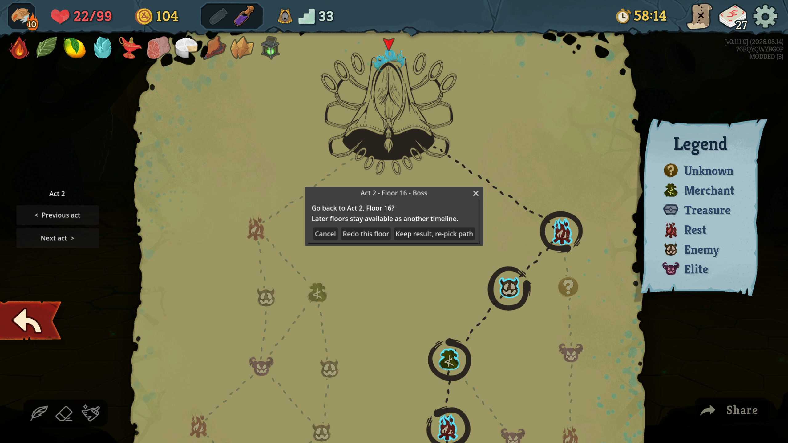

# UnDoFloor - Run Resumer 



## English

`UnDoFloor` is a Slay the Spire 2 C# mod that lets you go back to an earlier floor of your current run from the map screen.

The current source targets STS2 `0.111.0`. The mod compiles against the game's own `sts2.dll`, so a game update that changes internal names may require a matching mod update.

### Installation

Install from [Steam Workshop](https://steamcommunity.com/sharedfiles/filedetails/?id=3806367581) or download it from [Nexus Mods](https://www.nexusmods.com/slaythespire2/mods/1525).

For a manual install, copy the `StS2-UnDoFloor` folder (containing `StS2-UnDoFloor.dll` and `StS2-UnDoFloor.json`) into `<Slay the Spire 2>\mods\` and enable it in the game's mod screen.

Restore points are stored under `%APPDATA%\SlayTheSpire2\mod_configs\StS2-UnDoFloor\<run id>\`. Deleting that folder removes them.

### Features

- **Rewind to any floor you have visited in the current run.** Open the map and click a node that carries a sky-blue outline; a dialog offers the floor's restore points.
- **Two restore points per floor:**
  - *Redo this floor* — the moment you entered the room. The room is played again (combat, event, shop, rest site, treasure).
  - *Keep result, re-pick path* — the moment the room finished (combat won / event resolved), before you chose the next node. Available for combat and event rooms, which is where the game itself writes a "finished" save.
- **Previous acts.** When earlier acts have restore points, `< Previous act` / `Next act >` buttons appear on the left edge of the map screen. Browse an earlier act's map and click one of its nodes to rewind across acts.
- **Timelines are kept.** Rewinding never deletes later restore points. After going back and taking a different path, the old path's nodes keep their outline and stay clickable, so you can jump forward into the abandoned timeline again. A node that is saved again simply replaces its old restore point.
- **Survives quitting.** Restore points are written to disk per run and reloaded when you continue the run. Starting a new run discards the previous run's files.
- Nodes without a restore point behave exactly as before. On a node that is both a travel choice and a restore point, the dialog adds a *Travel here* button so normal travel is one extra click away.
- **Follows the game's language.** Every string the mod shows is translated into the 16 languages the game ships with and switches with the game's language setting. The act number, the room type and *Cancel* are read from the game's own text, so they read exactly as they do elsewhere in the UI; a language the mod has no entry for falls back to English.

### How it works

The game already writes a full run save when you enter a room and again when a combat or event finishes. The mod keeps a copy of each of those saves as a checkpoint (`FloorHistory`, mirrored to disk by `CheckpointStore`). Rewinding tears the current run scene down and loads the chosen save through the same path the main menu's *Continue* uses (`FloorRewinder`), which also rewrites the on-disk save so the rewound state is what you resume later. No live game state is copied or patched, so the restored state is exactly what the game itself would have loaded.

### Multiplayer

Singleplayer only. Checkpoints are recorded only from singleplayer saves and the rewind is blocked in multiplayer runs. The manifest declares `affects_gameplay: true`.

### Building

Requires the .NET 9 SDK and an installed copy of the game. The project references `sts2.dll`, `GodotSharp.dll` and `0Harmony.dll` from the game's `data_sts2_windows_x86_64` folder and copies the built mod into the game's `mods` folder after each build.

```powershell
dotnet build -c Release
# Game installed somewhere else:
dotnet build -c Release -p:Sts2InstallDir="D:\Games\Steam\steamapps\common\Slay the Spire 2"
# Or set the STS2_INSTALL_DIR environment variable. Skip the copy with -p:CopyToModsFolder=false.
```

The game locks the mod DLL while running, so close it before building.

### Project structure

```text
StS2-UnDoFloor.csproj
StS2-UnDoFloor.json
src/
```

- `StS2-UnDoFloor.csproj`: project file and game DLL references.
- `StS2-UnDoFloor.json`: STS2 mod manifest.
- `src/UnDoFloorMod.cs`: mod entry point; applies the Harmony patches.
- `src/FloorCheckpoint.cs`: one restore point (act, node, kind, save JSON).
- `src/FloorHistory.cs`: checkpoint list; records every singleplayer run save via a Harmony prefix on `RunSaveManager.SaveRun`.
- `src/CheckpointStore.cs`: per-run on-disk copy of the checkpoints.
- `src/FloorRewinder.cs`: tears down the run and loads a checkpoint's save.
- `src/MapRewindUi.cs`: outlines checkpoint nodes on the map, handles clicks, shows the dialog, intercepts the game's travel-on-click for those nodes.
- `src/ActBrowser.cs`: previous/next act buttons and the swapped-in map of a past act.
- `src/ModText.cs`: the mod's own text per language, plus the words it reads from the game's loc tables.

### Known limitations

- Only floors saved while the mod was installed have restore points; floors played before installing it are not available.
- The dialog uses a plain engine dialog rather than the game's UI style.

### Publishing to Steam Workshop

Uploads go through MegaCrit's official [sts2-mod-uploader](https://github.com/megacrit/sts2-mod-uploader). The `workshop/` folder is the uploader workspace: `workshop.json` (title, description, visibility, change note), `image.png` (main preview, under 1MB), `previews/` (extra screenshots shown on the Workshop page, each under 1MB; JPEGs downscaled from `screenshot/`) and `content/` (the files that get uploaded, staged by the script). `publish.ps1` builds Release, stages `content/` and runs the uploader:

```powershell
# ModUploader.exe extracted to C:\workspace\sts2-mod-uploader (or set STS2_MOD_UPLOADER / -UploaderDir)
.\publish.ps1 -ChangeNote "0.2.0 - first upload"
.\publish.ps1 -NoUpload      # build and stage only
```

Steam must be running. The first upload creates the item and writes `workshop/mod_id.txt`; commit it so later runs update the same item. Supported game branches (min/max) are best set on the item's Workshop page.

### Development note

Written with Claude Code, reviewed and tested by the author. The rewind pipeline follows the game's own save/load path; the snapshot-based [Undo And Restart](https://github.com/yuudong123/Sts2UndoAndRestart) mod was used as a reference for the mod project layout.

## 한국어

`UnDoFloor`는 Slay the Spire 2에서 지도 화면을 통해 현재 런의 이전 층으로 되돌아갈 수 있게 하는 C# 모드입니다.

현재 소스는 STS2 `0.111.0`을 기준으로 합니다. 게임의 `sts2.dll`을 직접 참조해 빌드하므로, 내부 이름이 바뀌는 게임 업데이트가 있으면 모드도 함께 업데이트가 필요할 수 있습니다.

### 설치

`StS2-UnDoFloor.dll`과 `StS2-UnDoFloor.json`이 들어 있는 `StS2-UnDoFloor` 폴더를 `<Slay the Spire 2>\mods\`에 넣고 게임의 모드 화면에서 활성화합니다.

복원 지점은 `%APPDATA%\SlayTheSpire2\mod_configs\StS2-UnDoFloor\<런 ID>\`에 저장됩니다. 이 폴더를 지우면 복원 지점이 사라집니다.

### 기능

- **현재 런에서 지나온 어느 층으로든 되돌아가기.** 지도를 열고 하늘색 테두리가 있는 노드를 클릭하면 그 층의 복원 지점을 고르는 다이얼로그가 뜹니다.
- **층마다 복원 지점 두 개:**
  - *이 층 다시 하기* — 방에 들어간 순간. 그 방(전투·이벤트·상점·휴식·보물)을 다시 플레이합니다.
  - *결과 유지, 경로 다시 선택* — 방이 끝난 순간(전투 승리 / 이벤트 종료), 다음 노드를 고르기 직전. 게임이 "완료" 세이브를 쓰는 전투·이벤트 방에서만 제공됩니다.
- **이전 막.** 이전 막에 복원 지점이 있으면 지도 왼쪽 가장자리에 `<  이전 막` / `다음 막  >` 버튼이 나타납니다. 이전 막 지도를 열어 노드를 클릭하면 막을 넘어 되돌아갑니다.
- **시간선 유지.** 되돌아가도 이후 층의 복원 지점은 지워지지 않습니다. 되돌아간 뒤 다른 길로 가도 옛 경로 노드는 테두리와 클릭이 유지되어, 버린 시간선으로 다시 앞으로 갈 수 있습니다. 같은 노드가 다시 저장되면 그 노드의 옛 복원 지점만 새 것으로 바뀝니다.
- **게임을 꺼도 유지.** 복원 지점은 런별로 디스크에 저장되고 이어하기 시 다시 불러옵니다. 새 런을 시작하면 이전 런의 파일은 정리됩니다.
- 복원 지점이 없는 노드는 기존과 완전히 같게 동작합니다. 다음 층 후보이면서 복원 지점도 있는 노드에서는 다이얼로그에 *여기로 이동* 버튼이 추가되어 한 번 더 클릭하면 평소처럼 이동합니다.
- **게임 언어를 따릅니다.** 모드가 표시하는 모든 문구는 게임이 지원하는 16개 언어로 번역되어 있으며 게임의 언어 설정에 따라 바뀝니다. 막 번호, 방 종류, *취소*는 게임 자체 문구를 읽어 쓰므로 다른 UI와 표기가 같습니다. 모드에 번역이 없는 언어는 영어로 표시됩니다.

### 동작 원리

게임은 방에 들어갈 때, 그리고 전투·이벤트가 끝날 때 런 전체 세이브를 씁니다. 모드는 그 세이브를 하나씩 체크포인트로 보관합니다(`FloorHistory`, `CheckpointStore`가 디스크에 미러링). 되돌리기는 현재 런 씬을 정리하고 선택한 세이브를 메인 메뉴 *이어하기*와 같은 경로로 로드합니다(`FloorRewinder`). 이때 디스크의 세이브도 덮어쓰므로 나중에 이어하기를 하면 되돌린 상태에서 시작합니다. 실행 중인 게임 상태를 복사하거나 고치지 않기 때문에, 복원되는 상태는 게임이 직접 로드했을 때와 정확히 같습니다.

### 멀티플레이어

싱글플레이 전용입니다. 체크포인트는 싱글플레이 세이브에서만 기록되고 멀티플레이 런에서는 되돌리기가 차단됩니다. 매니페스트는 `affects_gameplay: true`입니다.

### 빌드

.NET 9 SDK와 설치된 게임이 필요합니다. 프로젝트는 게임의 `data_sts2_windows_x86_64` 폴더에서 `sts2.dll`, `GodotSharp.dll`, `0Harmony.dll`을 참조하며, 빌드마다 결과물을 게임의 `mods` 폴더로 복사합니다.

```powershell
dotnet build -c Release
# 게임이 다른 위치에 설치된 경우:
dotnet build -c Release -p:Sts2InstallDir="D:\Games\Steam\steamapps\common\Slay the Spire 2"
# 또는 STS2_INSTALL_DIR 환경 변수를 설정합니다. 복사를 건너뛰려면 -p:CopyToModsFolder=false.
```

게임이 실행 중이면 모드 DLL이 잠겨 복사가 실패하므로, 빌드 전에 게임을 종료합니다.

### 프로젝트 구조

```text
StS2-UnDoFloor.csproj
StS2-UnDoFloor.json
src/
```

- `StS2-UnDoFloor.csproj`: 프로젝트 파일과 게임 DLL 참조.
- `StS2-UnDoFloor.json`: STS2 모드 매니페스트.
- `src/UnDoFloorMod.cs`: 모드 진입점. Harmony 패치를 적용합니다.
- `src/FloorCheckpoint.cs`: 복원 지점 하나(막, 노드, 종류, 세이브 JSON).
- `src/FloorHistory.cs`: 체크포인트 목록. `RunSaveManager.SaveRun`에 Harmony prefix를 걸어 모든 싱글플레이 런 세이브를 기록합니다.
- `src/CheckpointStore.cs`: 런별 디스크 저장.
- `src/FloorRewinder.cs`: 런을 정리하고 체크포인트의 세이브를 로드합니다.
- `src/MapRewindUi.cs`: 지도 노드 테두리 표시, 클릭 처리, 다이얼로그, 해당 노드에서 게임의 클릭 이동 가로채기.
- `src/ActBrowser.cs`: 이전/다음 막 버튼과 과거 막 지도 표시.
- `src/ModText.cs`: 모드 UI 문구의 언어별 표와, 게임 로컬라이제이션 테이블에서 읽어 오는 단어들.

### 알려진 제약

- 모드가 설치된 뒤 저장된 층만 복원 지점이 있습니다. 설치 전에 지나온 층은 되돌아갈 수 없습니다.
- 다이얼로그는 게임 UI 스타일이 아닌 엔진 기본 다이얼로그를 사용합니다.

### Steam 창작마당 게시

업로드는 MegaCrit 공식 [sts2-mod-uploader](https://github.com/megacrit/sts2-mod-uploader)로 합니다. `workshop/` 폴더가 업로더 작업 공간입니다: `workshop.json`(제목·설명·공개 범위·변경 노트), `image.png`(대표 미리보기, 1MB 미만), `previews/`(창작마당 페이지에 함께 표시되는 스크린샷, 각 1MB 미만; `screenshot/` 원본을 축소한 JPEG), `content/`(실제 업로드되는 파일, 스크립트가 채움). `publish.ps1`이 Release 빌드 → `content/` 준비 → 업로더 실행을 한 번에 합니다.

```powershell
# ModUploader.exe를 C:\workspace\sts2-mod-uploader에 풀어둔 경우 (또는 STS2_MOD_UPLOADER / -UploaderDir)
.\publish.ps1 -ChangeNote "0.2.0 - first upload"
.\publish.ps1 -NoUpload      # 빌드와 준비만
```

Steam이 실행 중이어야 합니다. 첫 업로드가 아이템을 만들고 `workshop/mod_id.txt`를 쓰니 커밋해 두면 이후 실행은 같은 아이템을 갱신합니다. 지원 게임 브랜치(최소/최대)는 창작마당 아이템 페이지에서 설정하는 것이 안정적입니다.

### 개발 노트

Claude Code로 작성하고 개발자가 검토·테스트했습니다. 되돌리기 파이프라인은 게임 자체의 세이브/로드 경로를 그대로 따르며, 프로젝트 구성은 스냅샷 기반 [Undo And Restart](https://github.com/yuudong123/Sts2UndoAndRestart) 모드를 참고했습니다.
